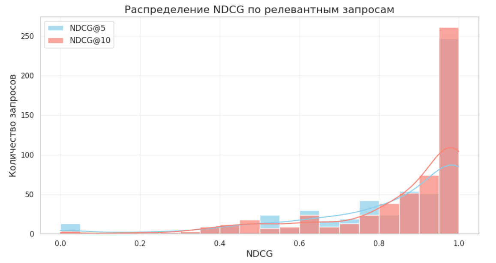

# Ranking-System

Проект по реализации ранжирования (Learning to Rank) на датасете Microsoft LETOR.

## Цель
Демонстрация полного ML-пайплайна для задачи ранжирования: от подготовки данных и вычисления метрик до обучения модели LightGBM Ranker и оценки качества на объединенном тестовом наборе.

## Данные
Используется датасет MQ2008 из коллекции [Microsoft LETOR](https://www.microsoft.com/en-us/research/project/letor-learning-rank-information-retrieval/).

## Метрики
NDCG@5, NDCG@10

## Результаты финального тестирования

| Тип запросов | Количество | Средний NDCG@5 | Средний NDCG@10 |
|--------------|------------|----------------|-----------------|
| Все запросы | 784 | 0.5934 | 0.6160 |
| Релевантные (max_label > 0) | 564 | 0.8248 | 0.8563 |
| Высокорелевантные (max_label = 2) | 331 | 0.8626 | 0.8838 |
| Без релевантных (max_label = 0) | 220 | 0.0000 | 0.0000 |

## Визуализация
Пример одного информативного графика: распределение NDCG@5 по релевантным запросам (без нерелевантных запросов):

